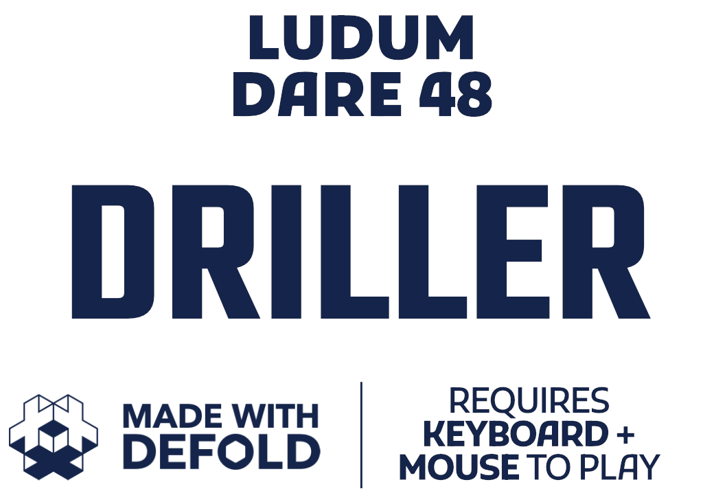

# WIP - DRILLER

## Ludum Dare 48 Game - Made With Defold

This project was created from the "empty" project template. **This is a work-in-progress game for the LD48.**

Play the latest version online - [**Web build**](https://aglitchman.github.io/defold-ld48-game/).

## Structure (WIP)

```yaml
/ld48: # Main folder

  # C++ sources
  /include:
  /manifests:
  /res:
  /src:

  # Assets
  /assets:

  # Lua sources
  /app: # Tools
  /screens: # Screens, i.e. collections used as proxies
    /testbed:

  /main.collection: # Bootstrap collection. It has links to all game collections and content
  /main.script: # Main script of the game.
```

### World

1 unit = 1 centimeter (models) = 1 pixels (sprites), and `cube_100.dae` is a 100x100x100cm cube.

### Dev Notes

Debug build for HTML5 using `bob.jar`:
```bash
BOB_SHA1=$(curl -s 'https://d.defold.com/beta/info.json' | jq -r .sha1)
wget --progress=dot:mega -O build/bob.jar "https://d.defold.com/archive/${BOB_SHA1}/bob/bob.jar"
rm -rf build/bundle && mkdir -p build/bundle && java -jar build/bob.jar --email foo@bar.com --auth 12345 --texture-compression true --bundle-output build/bundle/js-web --build-report-html build/bundle/report.html --platform js-web --variant debug --archive distclean resolve build bundle
http-server -c- # npm install http-server -g
```

Download [the latest HTML5 bundle in .zip](https://github.com/aglitchman/defold-ld48-game/archive/refs/heads/gh-pages.zip).

## Credits

Copyright (c) 2021 Artsiom Trubchyk. Licensed under the Apache License, Version 2.0. You may obtain a copy of the License at http://www.apache.org/licenses/LICENSE-2.0

This project is made with [the Defold game engine](https://www.defold.com/) and includes/uses the following deps:
- *NOT USED:* OpenGL Mathematics (GLM), a header only C++ mathematics library: https://github.com/g-truc/glm
- *NOT USED:* LearnOpenGL.com Camera class: https://learnopengl.com/code_viewer_gh.php?code=includes/learnopengl/camera.h
- https://github.com/kikito/tween.lua
- https://github.com/rxi/lume
- https://github.com/britzl/ludobits
- https://github.com/subsoap/defos
- https://github.com/indiesoftby/defold-splitmix64
- https://github.com/indiesoftby/defold-sharp-sprite
- to be filled...

Plus used these content generators:
- Intro/outro planet texture: https://donjon.bin.sh/scifi/world/
